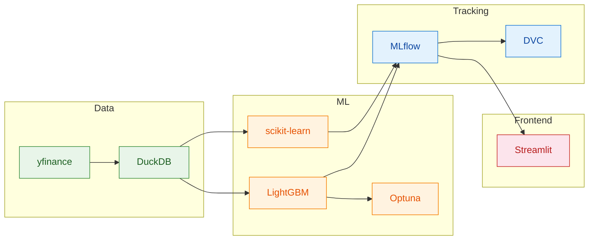

# ML Stock Prediction

Machine learning pipeline for S&P 500 directional forecasting (up/down/neutral) using technical indicators, with MLflow experiment tracking and a Streamlit dashboard.

**[▶ Live Demo](https://ml-stock-pred.streamlit.app/)**: Interactive dashboard with candlestick charts, model predictions, and performance metrics for the S&P 500.

## Stack



<p align="center">
  
  
  
  
  
  
  
  
  
</p>

## Quickstart

```bash
poetry install
make pipeline   # fetch → train → predict
make fe         # launch dashboard
```

## Pipeline Stages

| Stage | Command | Description |
|-------|---------|-------------|
| Fetch | `make fetch` | Downloads OHLCV data from Yahoo Finance, computes technical indicators |
| Train | `make train` | Trains ExtraTrees (default) or LightGBM with Optuna hyperparameter tuning |
| Predict | `make predict` | Generates predictions using the best registered model |

## Configuration

All parameters live in `params.yaml` — symbol, prediction horizon, feature windows, training window, tuning trials.

## Project Layout

- `backend/core/` — feature engineering, indicators, schemas
- `backend/ml/` — model training, tuning, registry
- `backend/workflows/` — pipeline entry points (fetch, train, predict)
- `frontend/` — Streamlit app with candlestick charts
- `tests/` — pytest suite

## CI/CD

Two GitHub Actions workflows run the pipeline automatically. **Daily** (Mon–Fri after market close): fetches the latest data and generates predictions with the current champion model. **Weekly** (Sunday): runs full Optuna retraining and promotes a new model only if it beats the existing one.
